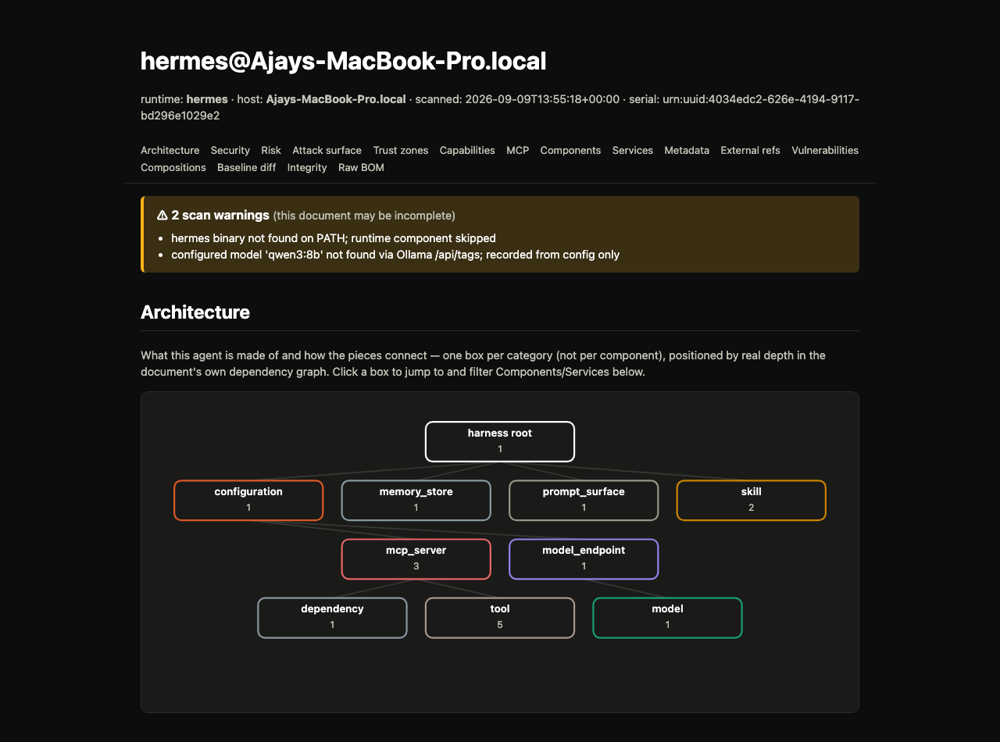

# agent-harness-aibom

[](https://github.com/Aj7Ay/agent-harness-aibom/actions/workflows/ci.yml)
[](https://pypi.org/project/agent-harness-aibom/)
[](LICENSE)

**An AI Bill of Materials (AIBOM) generator, security analyzer, and
CI gate for AI agent harnesses.**

Point it at a running [Hermes](https://github.com/nousresearch/hermes-agent) or [OpenClaw](https://docs.openclaw.ai) installation and it answers the question a general-purpose SBOM scanner can't: *what exactly does this agent have access to?* Its runtime binary, the model(s) it talks to, the skills and MCP servers and hooks it can reach, the secrets surface around all of that - recorded as a standard, tool-agnostic [CycloneDX 1.6](https://cyclonedx.org/) document, then analyzed for risk, attack surface, and blast radius without ever leaving that standard.

```bash
pip install agent-harness-aibom
harness-aibom scan --runtime auto -o aibom.json
harness-aibom report aibom.json -o report.html
```



## Why CycloneDX, not a custom format

Every fact this tool collects is real, on-disk state - nothing inferred, nothing scored by an opaque model. It stays inside the official
CycloneDX 1.6 schema everywhere a native field exists (`purl`, `hashes`, `licenses`, `supplier`, `externalReferences`, the dependency graph), and adds harness-specific facts as a `harness-aibom:` property namespace alongside them - so a generic CycloneDX/SBOM tool that ignores unknown properties still gets a valid, useful BOM, and this project's own `validate`/`diff`/`report`/`policy` commands get everything they need on top of it. See [`SPEC.md`](SPEC.md) for the full data model and the reasoning behind every field.

## What it collects

| Class | What it is |
|---|---|
| `runtime` | The harness binary itself - version, install method, upstream hash |
| `model` | Every model behind the configured endpoint, via Ollama's own API - digest, family, parameter size, quantization, context length |
| `model_endpoint` / `mcp_server` | Native CycloneDX *services* - transport, TLS, auth posture, endpoint URLs |
| `tool` | One per MCP tool a server declares, with a name-based `read`/`write`/`exec`/`network` risk class |
| `skill` | Every `SKILL.md` at any depth, directory-hashed, with deterministic content analysis (referenced servers, URLs, shell commands, env vars) and real YAML frontmatter (`name`/`description`/`license`/`allowed-tools`) |
| `hook` | Shell hooks, their approval state, and whether their content has changed since approval |
| `configuration` | The harness's own config file, fingerprinted |
| `dependency` | The harness's Python packages and MCP launcher packages, with native `purl`, licenses, and supplier |
| `secrets_surface` | `.env` files, credential-shaped filenames, key/PEM files - location and permissions only, contents never read |
| `prompt_surface` | `AGENTS.md`/`CLAUDE.md` instruction files, fingerprinted |
| `memory_store` | Chroma/FAISS persistence files - location and permissions only, contents never read |

Twelve classes, all cross-referenced into one real dependency graph
(`harness → mcp_server → tool`, `harness → model_endpoint → model`, …) -
not a flat list of everything the harness happens to touch.

## Security analysis, built on top of the same document

Nothing here is a second, independent scan - every result below is a pure function over the CycloneDX document `scan` already produced re-derivable by anyone from the same JSON:

- **Risk observations** - a fixed, named set of explainable rules (world-readable secrets at two confidence tiers, plaintext unauthenticated MCP transport, unpinned launcher packages, models with no content digest, world-readable memory stores), never a single opaque score.
- **Attack surface & trust zones** - every component classified by where it actually sits (filesystem, local process, loopback, network, a credential store, a model provider), then split into what stays on the box versus what crosses a real network boundary.
- **Capability matrix** - componentClass × capability × reachability, aggregated - never a fabricated per-asset checklist of capabilities this scanner didn't actually observe.
- **Supply chain & blast radius** - for any component, an exact BFS over the real dependency graph in both directions: what it depends on, and what would be affected if it were compromised.
- **Baseline diff & digest drift** - diff two scans and see exactly what was added, removed, or changed, with a distinct callout when a model's own tag stays the same while its content digest doesn't.

## The AIBOM Explorer

`harness-aibom report` renders the whole document as a single, offline, static HTML file - no server, no CDN, no external dependency. Live search and class filtering, a click-through Component Inspector for every entry, a baseline-diff view, and an Artifact Integrity panel when
the document is signed. See [`examples/hermes-aibom.example.html`](examples/hermes-aibom.example.html) for a full, real rendering.

## Install

```bash
pip install agent-harness-aibom
```

or, with [uv](https://docs.astral.sh/uv/):

```bash
uv venv && source .venv/bin/activate && uv pip install agent-harness-aibom
```

For development, from a checkout:

```bash
uv sync --extra dev
```

## Usage

```bash
# Auto-detect and scan whatever's installed under $HOME
harness-aibom scan --runtime auto -o aibom.json

# Scan a specific runtime explicitly
harness-aibom scan --runtime hermes -o hermes-aibom.json
harness-aibom scan --runtime openclaw -o openclaw-aibom.json

# Check a document's shape and internal integrity (duplicate bom-refs,
# dangling dependency edges, malformed hashes, orphaned components)
harness-aibom validate aibom.json

# Compare two scans -- e.g. before/after a suspected skill compromise
harness-aibom diff before.json after.json

# ...or diff only the named security findings that changed
harness-aibom diff before.json after.json --security --exit-code

# Render a document as a single, offline, static HTML file
harness-aibom report aibom.json -o report.html

# ...with a baseline, to render what changed inline
harness-aibom report after.json --baseline before.json -o report.html

# Gate CI on the built-in risk rules (or your own policy-as-code rules)
harness-aibom policy aibom.json --fail-on high
harness-aibom policy aibom.json --policy-file policy.yaml
harness-aibom policy aibom.json --format sarif -o results.sarif

# Sign and verify an AIBOM with cosign, key-based and fully offline
harness-aibom scan --deterministic -o aibom.json
harness-aibom sign aibom.json --key cosign.key
harness-aibom verify-signature aibom.json --key cosign.pub
```

Run `harness-aibom <command> --help` for the full set of flags on any subcommand.

`scan` runs entirely against the local filesystem and local subprocesses/HTTP calls (`hermes`/`openclaw` CLIs, Ollama's `/api/tags`). To scan a remote box, install the package there (or SSH in and run it) - there's no built-in remote transport.

Missing pieces are never fatal: if `hermes` isn't on `PATH`, or Ollama isn't reachable, the scan still completes and prints a `warning[...]`
line to stderr explaining what it skipped, so the resulting document is never mistaken for a complete one.

## Example output

[`examples/hermes-aibom.example.json`](examples/hermes-aibom.example.json) and [`examples/openclaw-aibom.example.json`](examples/openclaw-aibom.example.json) were generated by running `scan` against the fixtures in `tests/fixtures/` and are schema-validated against the real CycloneDX 1.6 JSON Schema on every test run. Their `report` renderings are [`examples/hermes-aibom.example.html`](examples/hermes-aibom.example.html) and [`examples/openclaw-aibom.example.html`](examples/openclaw-aibom.example.html).

## Project layout

```
src/harness_aibom/
├── model.py           # Component / HarnessDocument -- the in-memory data model
├── cyclonedx.py        # model.py -> CycloneDX 1.6 JSON
├── security.py          # architecture graph, risk rules, attack surface, blast radius
├── report.py             # the AIBOM Explorer HTML report
├── validate.py            # structural + referential-integrity checks
├── diff.py                 # before/after comparison
├── policy_yaml.py           # policy-as-code rule evaluation
├── sarif.py                  # SARIF 2.1.0 output for code-scanning UIs
├── sign.py                    # cosign sign/verify wrapper
├── paths.py                    # relPath / symlink-escape helpers
├── fingerprint.py                # sha256 helpers
├── cli.py                         # `harness-aibom` entrypoint
└── collectors/
    ├── base.py                      # Collector ABC
    ├── ollama.py                     # shared: model discovery via Ollama's HTTP API
    ├── mcp.py                         # shared: MCP server extraction from a config dict
    ├── deps.py                         # shared: Python dependency inventory
    ├── secrets.py                       # shared: secrets-surface discovery (paths/perms only)
    ├── skills.py                         # shared: SKILL.md discovery, frontmatter, content analysis
    ├── prompt_surface.py                  # shared: AGENTS.md/CLAUDE.md discovery
    ├── memory_store.py                     # shared: Chroma/FAISS discovery
    ├── hermes.py                             # Hermes collector
    └── openclaw.py                           # OpenClaw collector
```

## CI and publishing

- `.github/workflows/ci.yml` runs the test suite (including real, non-mocked cosign sign/verify tests) and a CLI smoke test on every push and pull request, on Python 3.10, 3.11, and 3.12.
- `.github/workflows/publish.yml` builds and publishes the package to PyPI when a GitHub Release is published, via PyPI Trusted Publishing - no password stored in this repo.

To ship a new version: bump `version` in `pyproject.toml` and `src/harness_aibom/__init__.py`, commit, push, then publish a GitHub Release with a matching tag (e.g. `v0.9.0`). The release triggers `publish.yml`, which builds and uploads it automatically.

## Testing

```bash
uv run pytest -q
```

Collector tests run entirely against fixtures under `tests/fixtures/` (`hermes_home/`, `openclaw_home/`) - no real `hermes`/`openclaw`/`ollama` needed. `test_cyclonedx_schema.py` validates real output against the official CycloneDX 1.6 JSON Schema; `test_sarif.py` does the same for SARIF 2.1.0; `test_sign.py` and the `sign`/`verify-signature` tests in `test_cli.py` run against a real, locally installed `cosign` binary and skip themselves (never mock it) when one isn't on `PATH`.

## What's not here yet

This project only ever ships a feature once it's been verified against real behavior, not because it looks reasonable - that discipline is
documented in full, including every deliberate deferral and the reasoning behind it, in [`SPEC.md`](SPEC.md). Currently open: a per-relationship confidence/provenance model, an interactive per-instance dependency graph, tokenizer/dataset provenance, vulnerability/ VEX data, CycloneDX declarations and attestations, and a compliance control mapping (NIST AI RMF, ISO 42001, OWASP Agentic AI, MITRE ATLAS,SLSA) - each waiting on either a real data source or its own design pass, not attempted half-way.

## License

MIT - see [`LICENSE`](LICENSE).
